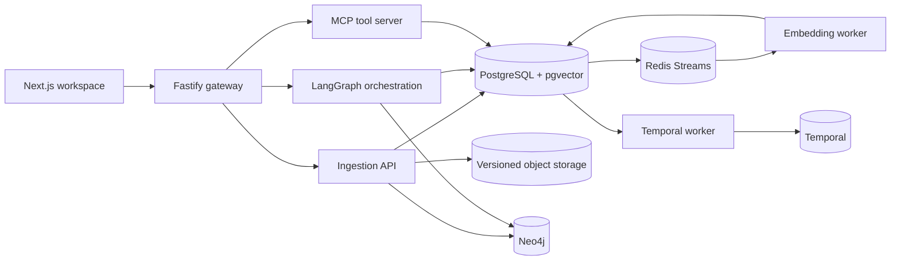

<div align="center">
  

  <p><strong>Evidence-first workspace intelligence for long-lived document collections.</strong></p>

  <p>
    <a href="https://github.com/sandeepbist/Certus/actions/workflows/ci.yml"></a>
    <a href="LICENSE"></a>
    
    
    
  </p>

  <p>
    <a href="#why-certus">Why Certus</a> ·
    <a href="#architecture">Architecture</a> ·
    <a href="#quick-start">Quick start</a> ·
    <a href="#development">Development</a> ·
    <a href="CONTRIBUTING.md">Contributing</a>
  </p>
</div>

> [!IMPORTANT]
> Certus is under active development and currently targets local evaluation. It has not completed the deployment, recovery, load, or security work required for an internet-facing production service.

## Why Certus

Certus is built for collections that outlive a chat session. Upload PDFs, Markdown, DOCX, or text over months or years, then ask for a fact, compare historical versions, or inspect how an answer was produced.

The system keeps three things separate:

- **Source authority:** original bytes, immutable versions, parsed artifacts, and exact text or PDF locations.
- **Retrieval:** tenant-scoped vector, full-text, literal, temporal, and graph search.
- **Generation:** claims are assembled from authorized evidence, validated, and released with citations or an explicit abstention.

Prior chat turns can help resolve a follow-up question, but they never become citation evidence.

## What works today

| Area | Current implementation |
| --- | --- |
| Documents | PDF, Markdown, DOCX, and text ingestion with immutable versions and retained originals |
| Retrieval | PostgreSQL full-text search, pgvector similarity search, reciprocal-rank fusion, literal matching, temporal scope, and Neo4j traversal |
| Evidence | Version hashes, exact parsed-text selectors, native-PDF glyph regions, claim-level evidence links, and explicit abstention |
| Agent runtime | LangGraph router, planner, researcher, tools, executor, and critic with progressive streaming |
| Sessions | Tenant-owned chat sessions with bounded, replayable conversation context |
| Tools | MCP Streamable HTTP tools for search, tasks, summaries, reminders, and graph queries |
| Durability | PostgreSQL outboxes, leased Redis Stream consumers, Temporal workflows, retries, and recovery workers |
| Product surface | Next.js workspace with documents, chat, tasks, memory, graph, analytics, traces, notifications, API keys, exports, and webhooks |
| Identity | Better Auth sessions, organizations, 2FA, passkeys, OAuth, and scoped workspace API keys |

Certus can run without an AI provider key. In that mode, retrieval uses its deterministic local fallback and answers are extractive rather than generated by a local LLM. Add an OpenAI key to enable hosted query embeddings and grounded generation.

## Architecture



The Fastify gateway is the application boundary. Browser requests are authenticated there before reaching the internal Python services. PostgreSQL remains authoritative for product state and durable work intent; Redis carries compact at-least-once delivery messages; object storage retains exact source bytes.

### Evidence path

```text
original file
    → immutable source version
    → parsed artifact and layout metadata
    → deterministic chunks and embedding profile
    → authorized hybrid retrieval
    → bounded evidence manifest
    → validated claims with source selectors
    → answer or abstention
```

## Quick start

### Requirements

- [Bun](https://bun.sh/) 1.4 or newer
- Python 3.12 or newer with `venv`
- Docker with Docker Compose
- Bash and OpenSSL

### Install

```bash
git clone https://github.com/sandeepbist/Certus.git
cd Certus
cp .env.example .env
make setup
```

`make setup` installs locked JavaScript and Python dependencies, generates local-only secrets, starts PostgreSQL, RustFS, Neo4j, Redis, and Temporal, applies migrations, and starts the workflow worker.

Start the application services:

```bash
make dev
```

Open [http://localhost:3000](http://localhost:3000), create an account, and create a workspace. Setup does not seed fake users or product data.

### Local endpoints

| Service | Address |
| --- | --- |
| Web application | `http://localhost:3000` |
| Gateway | `http://localhost:4000` |
| Ingestion API | `http://localhost:8001` |
| Orchestration API | `http://localhost:8002` |
| MCP server | `http://localhost:8003/mcp` |
| Object-storage console | `http://localhost:9001` |
| Neo4j Browser | `http://localhost:7474` |
| Temporal UI | `http://localhost:8233` |

## Configuration

`.env.example` documents every supported setting. Local setup fills the Better Auth secret, internal-service token, and object-storage credentials when they are empty.

Provider keys are optional:

```dotenv
OPENAI_API_KEY=
OPENAI_EMBEDDING_MODEL=text-embedding-3-small
OPENAI_FAST_MODEL=gpt-5.4-mini
OPENAI_REASONING_MODEL=gpt-5.5
```

Keep `WEBHOOK_ALLOW_PRIVATE_TARGETS=false` outside an isolated development environment. Do not pass database, authentication, provider, or internal-service secrets as Docker build arguments.

## Development

### Common commands

| Command | Purpose |
| --- | --- |
| `make setup` | Install dependencies, start infrastructure, and apply migrations |
| `make dev` | Run all application services with the local supervisor |
| `make check` | Run lint, type checks, unit tests, Python contracts, and the provider-free retrieval gate |
| `make smoke` | Probe a running stack without creating product data |
| `bun run eval:pgvector` | Compare the production pgvector path with an exact-search oracle |
| `make docker-logs` | Follow infrastructure logs |
| `make docker-down` | Stop containers while preserving volumes |
| `make clean` | Remove generated build and test artifacts while keeping dependencies |

Run the full repository gate before opening a pull request:

```bash
make check
```

For optimized application builds:

```bash
bun run build:gateway
bun run build:web
```

### Repository map

```text
services/
  web/             Next.js application and Better Auth boundary
  gateway/         Authenticated REST and WebSocket gateway
  ingestion/       Parsing, versioning, chunking, and graph sync
  embedding/       Redis consumer and pgvector writer
  orchestration/   Query planning, retrieval, generation, and traces
  mcp-tools/       MCP tools and internal tool facade
  workflows/       Temporal worker and durable dispatchers
  shared/          Shared Python contracts
infra/
  db/migrations/   Immutable PostgreSQL migrations
  neo4j/           Neo4j constraints and indexes
evals/             Retrieval datasets and exact-oracle checks
scripts/           Setup, migration, cleanup, and verification
tests/             Bun and Python contract tests
```

## Operational notes

- `/health` reports process liveness. `/health/ready` checks the dependencies required to accept traffic.
- Applied PostgreSQL migrations are checksum-protected. Add a new numbered migration instead of editing an applied file.
- `make clean` preserves `.venv` and `node_modules` to avoid needless reinstalls.
- `make docker-reset` deletes local database, object, graph, Redis, and Temporal volumes. Use it only when you intend to erase all local data.
- Internal Python services, PostgreSQL, Redis, Neo4j, and Temporal must not be exposed directly to the public internet.

## Project status

The local system has broad contract coverage, but public deployment remains unfinished. Before operating Certus with sensitive or customer data, complete at least:

- managed secrets and least-privilege runtime identities;
- TLS, routing, and network isolation;
- backup, restore, and disaster-recovery drills;
- production telemetry, SLOs, alerts, and runbooks;
- load, soak, failure, and adversarial-security testing;
- coordinated data deletion and compliance workflows.

See [SECURITY.md](SECURITY.md) for vulnerability reporting and deployment cautions.

## Contributing

Bug reports, focused fixes, tests, and documentation improvements are welcome. Read [CONTRIBUTING.md](CONTRIBUTING.md) before submitting a pull request. By participating, you agree to follow the [Code of Conduct](CODE_OF_CONDUCT.md).

## License

Certus is available under the [MIT License](LICENSE).
